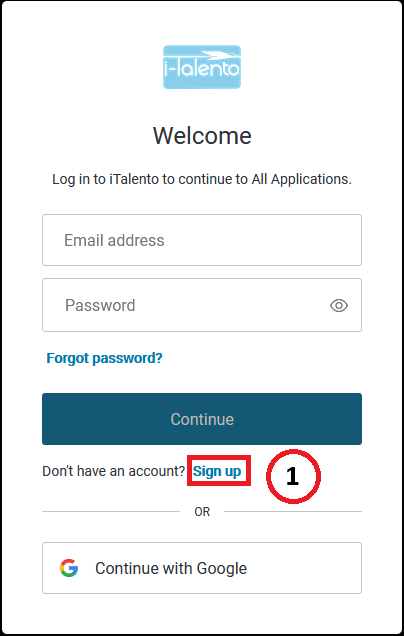
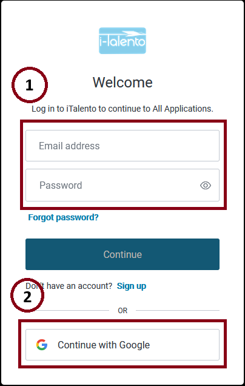

# Registro e Inicio de Sesión

Bienvenido a iTalento, para comenzar por todas las carácteristicas que tiene esta aplicación, es primordial registrarse o iniciar sesión. Durante el recorrido de esta página te enseñaremos el proceso de registro e inicio de sesión.

## Plataforma de Autenticación

iTalento utiliza Auth0, una potente plataforma de gestión de usuarios que nos permite brindarte la mayor seguridad para tus datos posible,y así mismo nos proporciona la oportunidad de ofrecerte una experiencia de registro muy simplificada. Al hacer click al botón de login en la página principal de iTalento, se te redirigirá a Auth0:

Aquí puede iniciar sesión (en caso de ya estar registrado) o registrate en iTalento oprimiendo la opción (1).

:::note[Nota]

Para registrarte en iTalento es necesario aceptar los [términos y condiciones](https://italento.shop/tyc)

:::

Luego de esto, podrás registarte usando un correo electrónico, o usando la opción de Google. Al terminar de ingresar los datos (o de iniciar con Google), se te redirigirá al formulario de registro en iTalento:

Para tener la mejor experiencia de usuario dentro de iTalento es necesario llenar la mayoría de los campos, al finalizar, confirma el registro y felicidades!, ya eres parte de iTalento.

---

## Inicio de Sesión

Para iniciar sesión solo es necesario entrar por el botón de la página principal, y acceder usando tus credenciales de inicio de sesión (1) o usando Google (2):

En caso de que hayas olvidado la contraseña, puedes hacer click en el botón correspondiente. En otro caso, has inciado sesión satisfactoriamente.