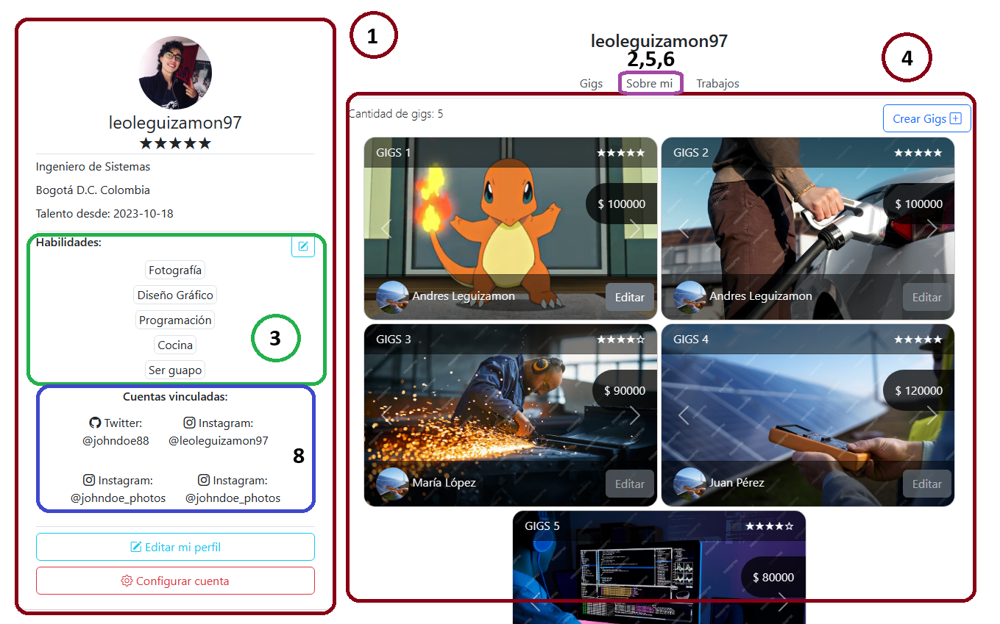

# Perfil

Bienvenido a iTalento, ahora veremos tu página de Perfil.

En iTalento, tu perfil funciona de hub principal para todas tus actividades en iTalento, inicia sesión en tu cuenta de Fiverr para acceder a tu perfil. Una vez dentro, haz clic en tu avatar o nombre de usuario en la esquina superior derecha de la pantalla para acceder a tu perfil.:

## Secciones Principales del Perfil

### 1. **Información General**

En la columna izquierda, encontrarás información general sobre tu perfil. Esto incluye tu foto de perfil, nombre de usuario, tu descripción, país de origen y un resumen de tus estadísticas, como el número de pedidos completados y la valoración promedio.

### 2. **Biografía y Descripción**

Aquí puedes agregar una biografía o descripción que detalla tus habilidades, experiencia y lo que ofreces en Fiverr. Esta sección permite a los compradores conocerte mejor y entender tus servicios.

### 3. **Habilidades y Servicios**

Muestra tus habilidades principales y los servicios que ofreces. Puedes organizarlos en diferentes categorías para que los compradores encuentren fácilmente lo que ofreces.

### 4. **Portafolio de Trabajo**

El portafolio te permite mostrar ejemplos de tu trabajo previo. Puedes agregar imágenes, videos o archivos relacionados con tus servicios para que los posibles compradores vean la calidad de tu trabajo.

### 5. **Experiencia Laboral y Educación**

Aquí puedes listar tu experiencia laboral previa y tu educación. Esto ayuda a establecer credibilidad y confianza con los compradores.

### 6. **Certificaciones y Logros**

Si tienes certificaciones relevantes o premios que puedan ser de interés para tus clientes potenciales, esta sección es donde puedes mostrarlos.

### 7. **Opiniones y Valoraciones**

En esta sección se muestran las opiniones y valoraciones de tus clientes anteriores. Las valoraciones positivas pueden ayudar a construir confianza con los compradores potenciales.

### 8. **Detalles de Contacto y Redes Sociales**

Aquí puedes proporcionar información de contacto adicional, como enlaces a tus perfiles en redes sociales o detalles para contactarte fuera de la plataforma.

## Edición y Actualización

- Para editar tu perfil, simplemente haz clic en el botón "Editar Perfil". Desde allí, podrás agregar, modificar o eliminar información en las diferentes secciones de tu perfil.

¡Listo! Esta guía proporciona una descripción detallada de las secciones clave que componen tu página de perfil en iTalento, permitiéndote presentar tus servicios y habilidades de manera efectiva para los compradores interesados.
